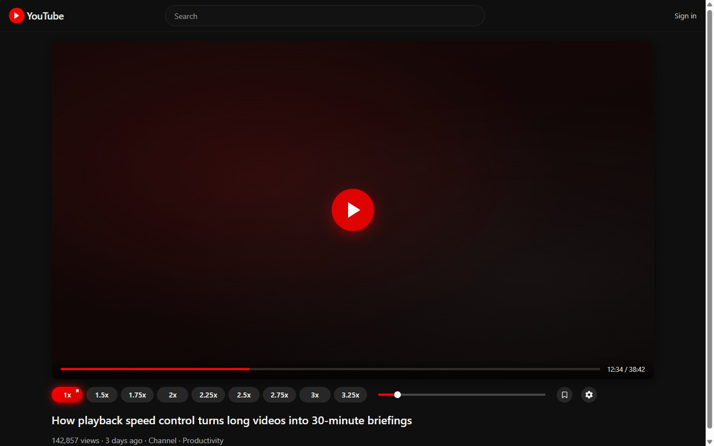
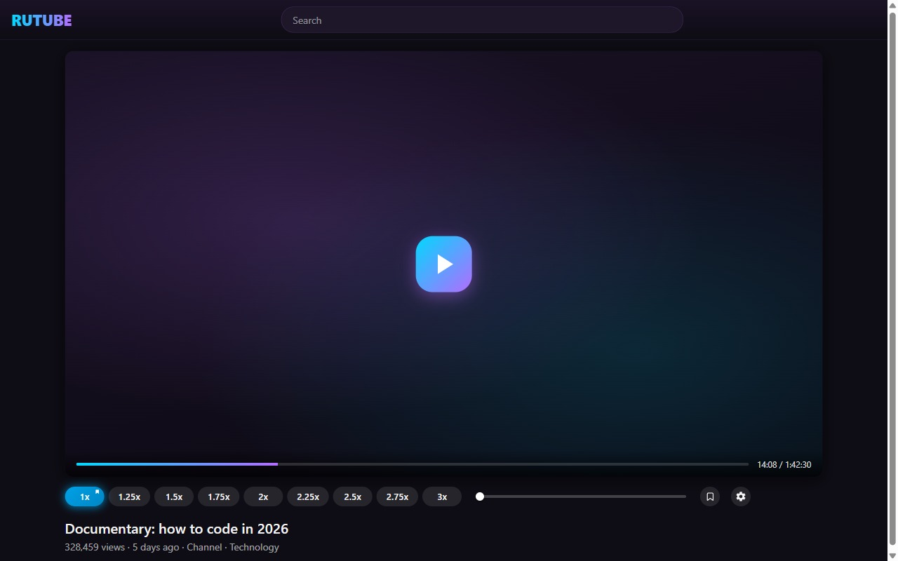
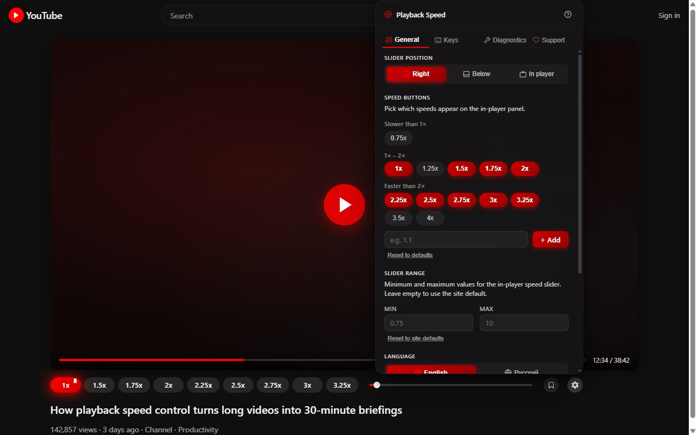
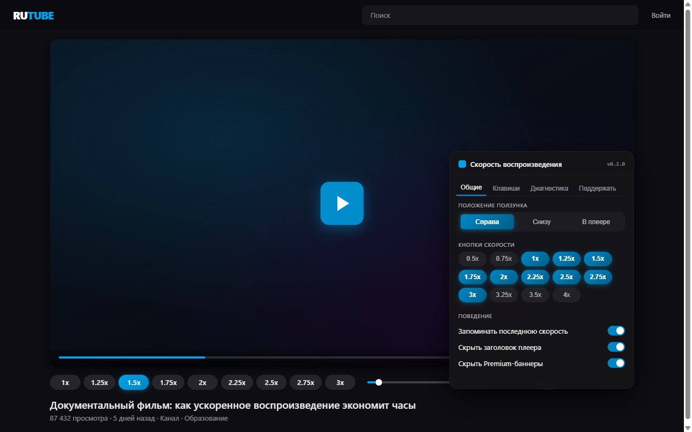

# Video Speed Controller (YouTube + RuTube)

[English](#english) | [Русский](#russian)

---

## English

Cross-browser extension that adds **speed buttons, a slider, and
configurable hotkeys** to YouTube and RuTube players. English / Russian
UI, no telemetry, settings stored locally.

> Distributed as three packages from a single source:
> - Chrome MV3 (`.zip`) for the Chrome Web Store
> - Firefox MV3 (`.xpi`) for Mozilla Add-ons (AMO)
> - Tampermonkey-style userscript (`.user.js`) for users who prefer
>   Tampermonkey / Violentmonkey

### Features

- **Per-site speed presets** — 9 buttons on YouTube (1x ... 4x), 7 on
  RuTube (1x ... 3x).
- **Slider** with the same min/max as the buttons, accent-coloured fill.
- **Single-click** → temporary speed for this video only.
- **Double-click** → set as global default for the site.
- **Hotkeys** — Ctrl+C (+0.1) / Ctrl+V (-0.1) by default, fully
  rebindable in Settings.
- **In-player gear menu** — 3 tabs (General, Shortcuts, Diagnostics)
  with EN/RU language switcher, slider position toggles, RuTube-only
  hide-title / hide-Premium switches.
- **Toolbar popup** — mirror of the in-player menu, available without
  opening a video.
- **Self-diagnostics** — a watchdog detects broken selectors after site
  updates and tries 5 recovery strategies (cache, exact, substring,
  ancestor, geometric heuristic).
- **Bilingual** — 96 i18n keys, EN/RU; auto-detected from
  `navigator.languages` on first run.
- **Privacy** — all settings live in `browser.storage.local`. Zero
  telemetry, zero analytics, zero remote calls. AMO data-collection
  disclosure: `{ required: ['none'] }`.

### Screenshots

| YouTube panel | RuTube panel |
|---|---|
|  |  |

| Settings menu (YouTube) | Settings menu (RuTube) |
|---|---|
|  |  |

### Install

#### Chrome / Edge / Brave (MV3)

1. Build: `npm install && npx wxt build`
2. Open `chrome://extensions`, enable Developer mode
3. **Load unpacked** → `.output/chrome-mv3/`

For published Web-Store install, see the listing once submitted.

> Windows users with Cyrillic in the project path: copy
> `.output/chrome-mv3/` to `C:\Temp\videospeeds-build\` first —
> Chrome's `--load-extension=` flag rejects non-ASCII paths.

#### Firefox (MV3)

1. Build: `npx wxt build -b firefox --mv3`
2. `npx web-ext run --source-dir=.output/firefox-mv3` — launches a
   fresh Firefox with the extension installed temporarily

For permanent install, submit the AMO build (`npx wxt zip -b firefox
--mv3`) or sign locally with `web-ext sign`.

#### Tampermonkey / Violentmonkey

1. Build: `npm run build:userscript`
2. Open `dist-userscript/video-speeds.user.js` in your browser; TM/VM
   prompts to install.

### Migration from the legacy userscript

The extension imports settings from page `localStorage` on first run.
GM-storage data isn't accessible to web extensions; if you used the
older `YouTube & HDRezka Speeds.user.js`, see [docs/MIGRATION.md] for
the workarounds (open the userscript once with the latest version, or
use the JSON export/import buttons in Settings).

[docs/MIGRATION.md]: docs/MIGRATION.md

### Contributing

- `npm run typecheck` — TypeScript strict mode, must pass
- `npm test` — Vitest unit suite (197 tests cover storage, discovery,
  speed control, i18n, hotkey normalization, etc.)
- `npm run test:smoke:full` — Playwright-via-CDP runs every preset
  click, slider drag, hotkey, language switch, settings toggle, and
  SPA navigation; captures screenshots
- `npm run test:smoke:cdp` — lighter smoke (panel rendering only)
- `npm run build` / `npm run build:firefox` / `npm run build:userscript`

See [docs/CAVEATS.md] for build-time gotchas (Cyrillic paths,
Playwright-launch crashes on certain Windows configs, Firefox MAIN-world
timing) and the local CDP-smoke recipe.

[docs/CAVEATS.md]: docs/CAVEATS.md

### Sister project

[HDRezkaSpeeds](https://github.com/danscMax/HDRezkaSpeeds) — same
controller for **HDRezka**. Two extensions are kept separate so each
can declare narrow `host_permissions` in its manifest, which makes
Chrome Web Store and AMO review faster.

### License

GNU General Public License v3.0 or later (GPL-3.0-or-later) — see
[LICENSE](LICENSE). Copyright (C) 2026 MaxScorpy.

This program is free software: you can redistribute it and/or modify it
under the terms of the GNU General Public License as published by the
Free Software Foundation, either version 3 of the License, or (at your
option) any later version. The program is distributed in the hope that
it will be useful, but WITHOUT ANY WARRANTY — see the LICENSE file for
the full terms.

---

## Русский

[English](#english) | **Русский** ↑ [к началу](#video-speed-controller-youtube--rutube)

Кроссбраузерное расширение, которое добавляет **кнопки скорости,
ползунок и настраиваемые горячие клавиши** в плееры YouTube и RuTube.
Двуязычный интерфейс (English / Русский), без телеметрии, настройки
хранятся локально.

> Распространяется в трёх формах из одного исходника:
> - Chrome MV3 (`.zip`) для Chrome Web Store
> - Firefox MV3 (`.xpi`) для Mozilla Add-ons (AMO)
> - Userscript в стиле Tampermonkey (`.user.js`) для тех, кто
>   предпочитает Tampermonkey / Violentmonkey

### Возможности

- **Пресеты скорости по сайтам** — 9 кнопок на YouTube (1x ... 4x),
  7 на RuTube (1x ... 3x).
- **Ползунок** с теми же min/max что у кнопок, заливка в цвет
  акцента.
- **Один клик** → временная скорость только для этого видео.
- **Двойной клик** → закрепить как глобальную скорость для сайта.
- **Горячие клавиши** — Ctrl+C (+0.1) / Ctrl+V (-0.1) по умолчанию,
  полностью переназначаемые в настройках.
- **Меню на шестерёнке** — 3 вкладки (Общие, Клавиши, Диагностика)
  с переключателем EN/RU, тогглом положения ползунка и (только для
  RuTube) переключателями скрытия заголовка плеера / Premium-баннеров.
- **Иконка в тулбаре** — копия меню в плеере, доступна без открытия
  видео.
- **Самодиагностика** — watchdog обнаруживает поломку селекторов
  после обновлений сайта и пробует 5 стратегий восстановления (кеш,
  точное совпадение, подстрока, предок, геометрическая эвристика).
- **Двуязычный** — 96 ключей i18n, EN/RU; язык определяется
  автоматически из `navigator.languages` при первом запуске.
- **Приватность** — все настройки в `browser.storage.local`. Никакой
  телеметрии, никакой аналитики, никаких удалённых запросов.
  Декларация AMO data-collection: `{ required: ['none'] }`.

### Скриншоты

| Панель YouTube | Панель RuTube |
|---|---|
|  |  |

| Настройки (YouTube) | Настройки (RuTube) |
|---|---|
|  |  |

### Установка

#### Chrome / Edge / Brave (MV3)

1. Сборка: `npm install && npx wxt build`
2. Открыть `chrome://extensions`, включить «Режим разработчика»
3. **Загрузить распакованное расширение** → `.output/chrome-mv3/`

После публикации в Web Store устанавливайте через листинг.

> Для Windows-пользователей с кириллицей в пути проекта: сначала
> скопируйте `.output/chrome-mv3/` в `C:\Temp\videospeeds-build\` —
> Chrome `--load-extension=` не принимает не-ASCII пути.

#### Firefox (MV3)

1. Сборка: `npx wxt build -b firefox --mv3`
2. `npx web-ext run --source-dir=.output/firefox-mv3` — запустится
   свежий Firefox с временно установленным расширением

Для постоянной установки отправьте AMO-сборку (`npx wxt zip -b
firefox --mv3`) или подпишите локально через `web-ext sign`.

#### Tampermonkey / Violentmonkey

1. Сборка: `npm run build:userscript`
2. Откройте `dist-userscript/video-speeds.user.js` в браузере —
   TM/VM предложит установку.

### Миграция со старого юзерскрипта

При первом запуске расширение импортирует настройки из page
`localStorage`. GM-хранилище недоступно веб-расширениям; если вы
использовали старый `YouTube & HDRezka Speeds.user.js`, см.
[docs/MIGRATION.md] о вариантах (открыть юзерскрипт один раз в
последней версии или использовать кнопки JSON Export/Import в
настройках).

### Разработка

- `npm run typecheck` — TypeScript strict, должен проходить
- `npm test` — Vitest unit-тесты (197 тестов на storage, discovery,
  контроллер скорости, i18n, нормализация горячих клавиш и пр.)
- `npm run test:smoke:full` — Playwright через CDP прогоняет каждый
  клик пресета, перетаскивание ползунка, горячие клавиши,
  переключение языка, тогглы настроек, SPA-переходы; делает
  скриншоты
- `npm run test:smoke:cdp` — лёгкий smoke (только рендер панели)
- `npm run build` / `npm run build:firefox` / `npm run build:userscript`

См. [docs/CAVEATS.md] про build-time особенности (кириллица в
путях, падения Playwright-launch на некоторых Windows-конфигах,
Firefox MAIN-world тайминг) и локальный CDP-smoke рецепт.

### Связанный проект

[HDRezkaSpeeds](https://github.com/danscMax/HDRezkaSpeeds) — тот же
контроллер скорости для **HDRezka**. Два расширения сделаны
отдельно, чтобы каждое могло объявлять узкие `host_permissions` в
манифесте — это ускоряет ревью в Chrome Web Store и AMO.

### Лицензия

GNU General Public License v3.0 или позднее (GPL-3.0-or-later) —
см. [LICENSE](LICENSE). Copyright (C) 2026 MaxScorpy.

Это свободное программное обеспечение: вы можете распространять и
модифицировать его на условиях GNU General Public License,
опубликованной Free Software Foundation, версии 3 или любой более
поздней. Программа распространяется в надежде, что она будет
полезна, но БЕЗ КАКИХ-ЛИБО ГАРАНТИЙ — см. файл LICENSE для полных
условий.
