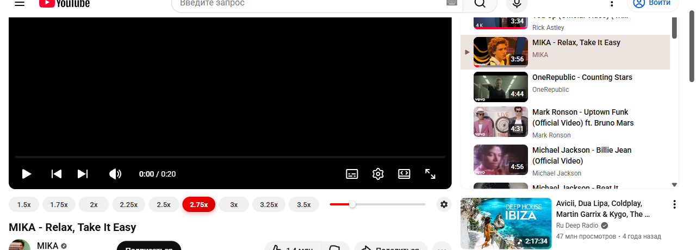
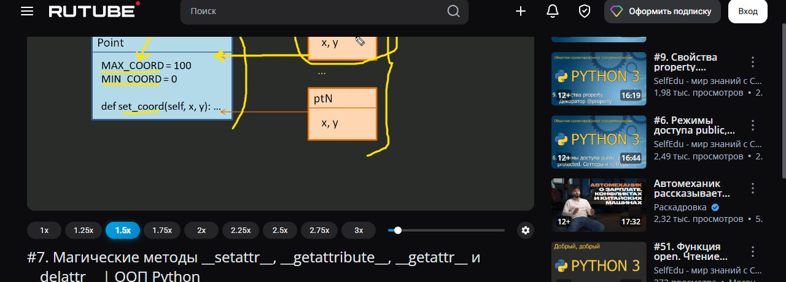
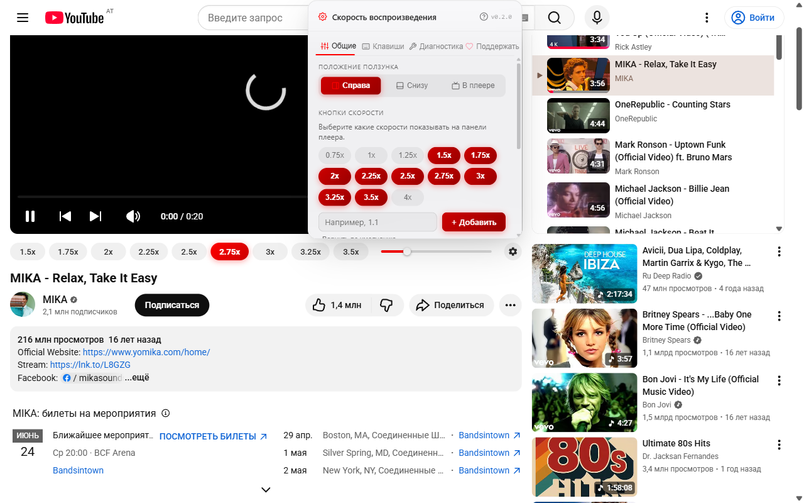
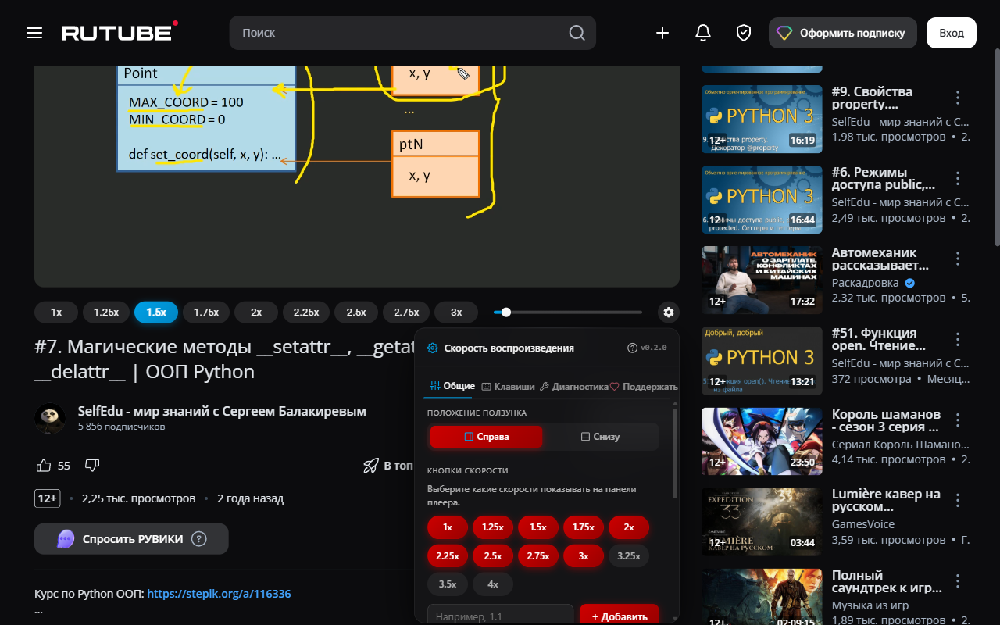

# Video Speed Controller (YouTube + RuTube)

Cross-browser extension that adds **speed buttons, a slider, and
configurable hotkeys** to YouTube and RuTube players. English / Russian
UI, no telemetry, settings stored locally.

> Distributed as three packages from a single source:
> - Chrome MV3 (`.zip`) for the Chrome Web Store
> - Firefox MV3 (`.xpi`) for Mozilla Add-ons (AMO)
> - Tampermonkey-style userscript (`.user.js`) for users who prefer
>   Tampermonkey / Violentmonkey

## Features

- **Per-site speed presets** -- 9 buttons on YouTube (1x ... 4x), 7 on
  RuTube (1x ... 3x).
- **Slider** with the same min/max as the buttons, accent-coloured fill.
- **Single-click** -> temporary speed for this video only.
- **Double-click** -> set as global default for the site.
- **Hotkeys** -- Ctrl+C (+0.1) / Ctrl+V (-0.1) by default, fully
  rebindable in Settings.
- **In-player gear menu** -- 3 tabs (General, Shortcuts, Diagnostics)
  with EN/RU language switcher, slider position toggles, RuTube-only
  hide-title / hide-Premium switches.
- **Toolbar popup** -- mirror of the in-player menu, available without
  opening a video.
- **Self-diagnostics** -- a watchdog detects broken selectors after site
  updates and tries 5 recovery strategies (cache, exact, substring,
  ancestor, geometric heuristic).
- **Bilingual** -- 96 i18n keys, EN/RU; auto-detected from
  `navigator.languages` on first run.
- **Privacy** -- all settings live in `browser.storage.local`. Zero
  telemetry, zero analytics, zero remote calls. AMO data-collection
  disclosure: `{ required: ['none'] }`.

## Screenshots

| Light theme (YouTube) | Dark theme (RuTube) |
|---|---|
|  |  |

| Settings menu (YouTube) | Settings menu (RuTube) |
|---|---|
|  |  |

## Install

### Chrome / Edge / Brave (MV3)

1. Build: `npm install && npx wxt build`
2. Open `chrome://extensions`, enable Developer mode
3. **Load unpacked** -> `.output/chrome-mv3/`

For published Web-Store install, see the listing once submitted.

> Windows users with Cyrillic in the project path: copy
> `.output/chrome-mv3/` to `C:\Temp\videospeeds-build\` first --
> Chrome's `--load-extension=` flag rejects non-ASCII paths.

### Firefox (MV3)

1. Build: `npx wxt build -b firefox --mv3`
2. `npx web-ext run --source-dir=.output/firefox-mv3` -- launches a
   fresh Firefox with the extension installed temporarily

For permanent install, submit the AMO build (`npx wxt zip -b firefox
--mv3`) or sign locally with `web-ext sign`.

### Tampermonkey / Violentmonkey

1. Build: `npm run build:userscript`
2. Open `dist-userscript/video-speeds.user.js` in your browser; TM/VM
   prompts to install.

## Migration from the legacy userscript

The extension imports settings from page `localStorage` on first run.
GM-storage data isn't accessible to web extensions; if you used the
older `YouTube & HDRezka Speeds.user.js`, see [docs/MIGRATION.md] for
the workarounds (open the userscript once with the latest version, or
use the JSON export/import buttons in Settings).

[docs/MIGRATION.md]: docs/MIGRATION.md

## Contributing

- `npm run typecheck` -- TypeScript strict mode, must pass
- `npm test` -- Vitest unit suite (197 tests cover storage, discovery,
  speed control, i18n, hotkey normalization, etc.)
- `npm run test:smoke:full` -- Playwright-via-CDP runs every preset
  click, slider drag, hotkey, language switch, settings toggle, and
  SPA navigation; captures screenshots
- `npm run test:smoke:cdp` -- lighter smoke (panel rendering only)
- `npm run build` / `npm run build:firefox` / `npm run build:userscript`

See [docs/CAVEATS.md] for build-time gotchas (Cyrillic paths,
Playwright-launch crashes on certain Windows configs, Firefox MAIN-world
timing) and the local CDP-smoke recipe.

[docs/CAVEATS.md]: docs/CAVEATS.md

## License

GNU General Public License v3.0 or later (GPL-3.0-or-later) -- see
[LICENSE](LICENSE). Copyright (C) 2026 MaxScorpy.

This program is free software: you can redistribute it and/or modify it
under the terms of the GNU General Public License as published by the
Free Software Foundation, either version 3 of the License, or (at your
option) any later version. The program is distributed in the hope that
it will be useful, but WITHOUT ANY WARRANTY -- see the LICENSE file for
the full terms.
